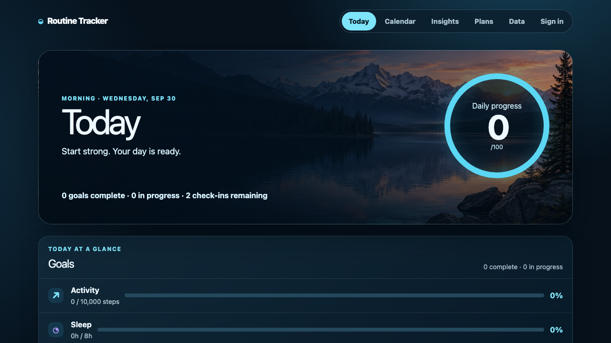
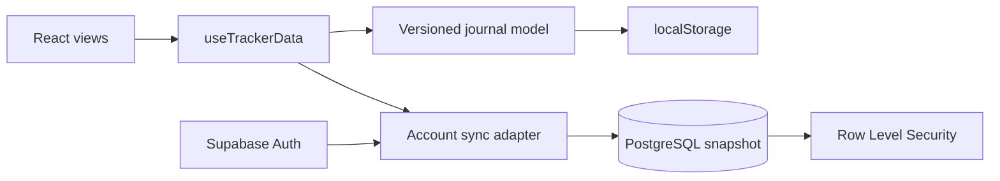
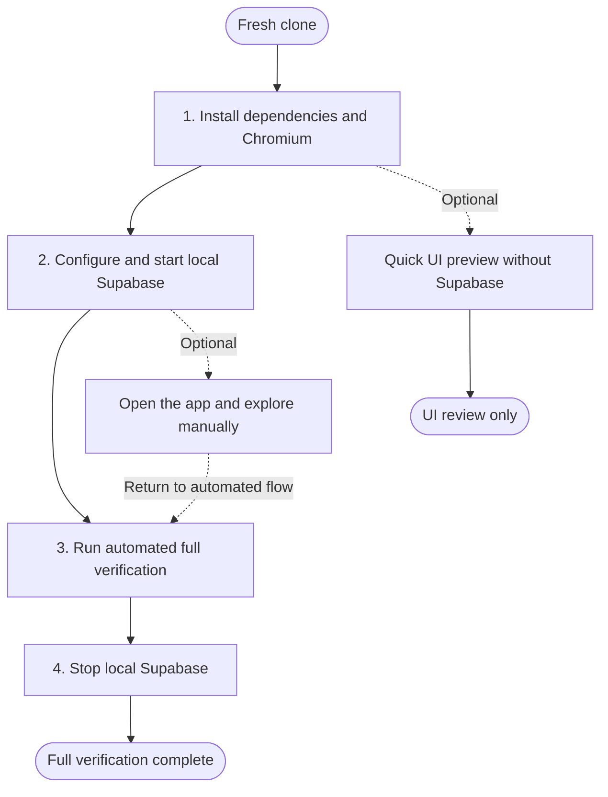

# Routine Tracker

A local-first React wellness journal built as a quality-engineering case study in safe persistence, account-scoped synchronization, PostgreSQL Row Level Security, accessibility, and layered regression testing.

[](https://github.com/YKalcheuskaya/routine-tracker/actions/workflows/verify.yml)

[Open the live demo](https://ykalcheuskaya.github.io/routine-tracker/) · [View the verification workflow](https://github.com/YKalcheuskaya/routine-tracker/actions/workflows/verify.yml) · [Read the product case study](docs/product-case-study.md)



The wellness journal is the domain used to exercise these engineering concerns. The live site is a credential-free guest preview: it stores fictional entries in that browser only. Authenticated synchronization and database authorization remain reproducible through the repository's automated local Supabase environment and GitHub Actions.

## Failure modes prevented

- [A failed snapshot read cannot overwrite the server journal with fallback data](e2e/local-auth.spec.js).
- [Rapid account updates stay ordered and late callbacks cannot cross account boundaries](src/features/tracker/use-tracker-data.test.jsx).
- [Malformed imports, server snapshots, and migrated records are rejected before rendering](src/features/tracker/tracker-storage.test.js).
- [Direct two-account checks prove owner access and deny cross-account select, insert, update, and delete](scripts/verify-rls.mjs).

## What this project demonstrates

- Feature-oriented React architecture with reusable components and immutable state updates.
- A versioned JSON contract with validation, recovery, and migrations from legacy versions.
- Browser-first persistence with optional authenticated Supabase synchronization.
- Email/password authentication and database-enforced per-account authorization.
- Unit, component, end-to-end, mobile, accessibility, and account-isolation testing.
- Reproducible local delivery through npm scripts, Docker, Supabase CLI, and SQL migrations.

## Architecture



`src/features/tracker/` owns the version-3 contract, validation, legacy migration, immutable mutations, local persistence, and import/export boundary. `src/features/wellness/` contains the domain model and pure calculations. `src/features/cloud/` isolates authentication and account-scoped synchronization from the UI.

Signed-out use remains local. Guest and account journals use separate browser-storage keys. After authentication, the application hides the journal until it loads or creates that account's validated snapshot, then caches normalized state under that account's key and queues changes to PostgreSQL in order. A failed snapshot read keeps edits in the matching browser cache but disables cloud writes until a reload successfully reconnects, preventing fallback data from overwriting the server journal. RLS independently restricts `select`, `insert`, `update`, and `delete` to rows where `auth.uid() = user_id`. The browser receives only a publishable key.

For a compact step-by-step view of one signed-out journal update—from a Calendar form event through immutable state, browser persistence, and the refreshed UI—see the [representative local journal update flow](docs/architecture-and-testing.md#representative-local-journal-update-flow).

## Key engineering decisions

| Concern | Implementation |
| --- | --- |
| Schema evolution | Versions 1 and 2 migrate into the current version-3 journal |
| Invalid persisted data | Complete nested validation and recovery prevent malformed data from breaking rendering |
| Import safety | Only a complete valid version-3 structure is accepted; replacement requires review and confirmation |
| Local/cloud boundary | Guest and account journals have distinct browser cache keys and optional local account sync |
| Account isolation | UI ownership gates and PostgreSQL RLS both prevent cross-account journal display or access |
| Testability | Validation, mutations, dates, and calculations remain separate from rendered views |

## Run and verify

The primary workflow is automated. A complete run starts the local infrastructure, executes every verification layer, and reports the result without requiring manual interaction with the UI.



### Prerequisites

- Node.js 24.12.0 exactly (recorded in `.nvmrc` and enforced by `package.json`)
- npm
- Docker Desktop for the full workflow

### Terminal and Node runtime

Run Steps 1–4 from the same terminal session. Before installing dependencies, record the active Node runtime:

```bash
command -v node
node -p "process.version + ' ' + process.arch"
npm --version
```

On Apple Silicon, use a native `arm64` terminal and Node binary. If `nvm use` selects an older or `x64` installation, select a native Node 24.12.0 installation before `npm ci`; do not alternate architectures against the same `node_modules` directory. GitHub Actions reads the same `.nvmrc` file, so local and CI verification use the same Node release.

`npm run supabase:start` starts the Docker services in the background and then returns the command prompt. It does not require a second terminal. Continue to Step 3 in the same terminal after the Supabase status table and shell prompt appear.

If you do open another terminal, return to this project directory and run the Node command above again. Its version and architecture must match the terminal used for `npm ci`. The installed `node_modules` directory is shared, so do not repeat Step 1 merely because the terminal is new. If the runtimes differ—for example, one reports `arm64` and the other `x64`—select one Node installation consistently and then run `npm ci` once with that runtime before continuing.

### Step 1 — Install dependencies and Chromium

Run these commands once after cloning:

```bash
npm ci
npx playwright install chromium
```

`npm ci` installs the exact dependency versions from `package-lock.json`. Chromium is required by both Playwright suites.

### Step 2 — Configure and start local Supabase

1. Start Docker Desktop.
2. Start local Supabase:

   ```bash
   npm run supabase:start
   ```

   Wait for this command to finish and return the shell prompt. Supabase remains active in Docker, so no foreground process needs to stay open.

3. Generate the ignored Vite configuration from the running local stack:

   ```bash
   npm run supabase:env
   ```

   The command writes only the local API URL and browser-safe publishable key to `.env.local` and does not print their values. Never put the database URL, secret key, service-role key, or S3 credentials in a `VITE_` variable.

The version-controlled migration is applied by the local stack. The schema and RLS policies are in `supabase/migrations/20260922130000_create-wellness-snapshots.sql`.

### Step 3 — Run automated full verification

Run one command:

```bash
npm run verify:full
```

It executes the layers below in order:

| Command | Layer | What it verifies |
| --- | --- | --- |
| `npm run lint` | Static analysis | React and JavaScript source plus project configuration |
| `npm test` | Unit and component | Data validation/migration, mutations, dates, calculations, rendered states, and forms |
| `npm run build` | Build integration | Production bundling and module resolution |
| `npm audit` | Dependency security | Known vulnerabilities in the installed dependency graph |
| `npm run test:rls` | Direct database authorization | Owner access plus cross-account select, insert, update, and delete denial with two disposable users |
| `npm run test:browser` | Browser E2E, accessibility, and auth/database integration | Local journeys plus two-account snapshot synchronization and observable cross-account isolation on desktop and mobile |

Playwright starts and stops its own Vite server on port `4173`. The account suite creates two disposable users, writes data for the first account, and verifies that the second account starts with an independent journal.

Expected results for the current test set:

- 10 Vitest files and 32 tests;
- 12 Playwright desktop/mobile product, persistence, import-safety, and accessibility checks;
- 6 Playwright desktop/mobile account-isolation, session-expiry, and read-failure checks;
- direct RLS owner and cross-account select/insert/update/delete verification;
- successful lint and production build;
- 0 known dependency vulnerabilities.

Every Playwright run keeps the console reporter and writes an ignored HTML report plus JUnit XML. Failed checks also retain a trace and screenshot in `test-results/`. Open the local HTML report with `npx playwright show-report`.

GitHub Actions starts the local Supabase stack, reapplies the version-controlled migration, generates the browser-safe local configuration without logging key values, runs this same full gate, and always attempts to stop the stack. Each run includes a short job summary and uploads `playwright-report/` plus `test-results/` for 14 days, including on failed runs. After a successful `main` run, a dependent job builds the explicit guest mode, verifies its repository asset path and absence of local Supabase configuration, and deploys it to GitHub Pages.

The project does not maintain a reduced smoke suite because the complete browser suites are already small and fast. To run only the Docker-independent layers during development, use `npm run verify:core`; targeted `npm run test:e2e` and `npm run test:local-auth` commands remain available for diagnosis.

### Step 4 — Stop local Supabase

```bash
npm run supabase:stop
```

Full verification is complete when Step 3 passes and the local stack is stopped cleanly.

## Optional manual exploration

Manual clicking is not part of the automated release gate. Use it only when you want to inspect the interface or demonstrate the account flow. Browser storage is a continuity cache, not protection against someone with access to this browser or machine.

After Step 2, start the application:

```bash
npm run dev:local
```

Open `http://127.0.0.1:5173`. You may create disposable `example.test` accounts, record fictional data, reload, sign out and back in, or create a second account to observe isolation. Stop the Vite process with `Ctrl+C`, then return to Step 3 for automated verification.

Unlike `supabase:start`, `dev:local` is a foreground process and occupies its terminal. The simplest path is to stop it with `Ctrl+C` before Step 3. If you keep it open and use a second terminal, confirm that the second terminal reports the same Node version and architecture; there is still no need to repeat `npm ci`.

## Optional quick UI preview

Use this branch after Step 1 only when Docker and account verification are not needed:

```bash
npm run dev
```

Open the Vite URL shown in the terminal, normally `http://localhost:5173`. With Supabase environment variables unset, this mode exercises the React interface, versioned `localStorage` persistence, import/export, and responsive UI. It does not verify authentication, PostgreSQL synchronization, or RLS.

## Local database reset

To rebuild the database from the version-controlled migration, run:

```bash
npx supabase db reset --local
```

This deletes only local demo accounts and entries.

## Contribution and project boundary

Julia owned product direction, requirements, visual direction, acceptance criteria, review, and validation. AI tools assisted implementation; this project is presented as a product-ownership and quality-engineering case study rather than independent React authorship. The [product case study](docs/product-case-study.md) records the scope and limits in more detail.

The public site is a guest-mode portfolio preview, not a hosted account or health service. It has no real users, clinical purpose, production availability commitment, or public Supabase backend. Use fictional data only.
