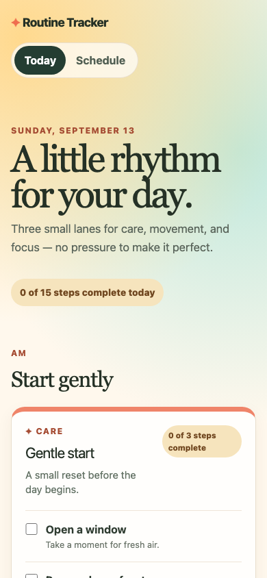

# Routine Tracker

A playful, local-first daily routine companion for care, movement, and focus. The app makes today's small actions easy to see and check off, while keeping the weekly template available as a read-only plan.

**Live demo:** Pending publication approval.
**Status:** Local portfolio release candidate; no remote is configured.

| Desktop | Mobile |
| --- | --- |
|  |  |

## What it does

- Shows AM and PM routines for the local calendar day.
- Tracks completed steps in the browser and resets to a fresh list on a new local date.
- Offers a read-only weekly schedule so planning does not create accidental historical progress.
- Handles unavailable or malformed browser storage without crashing.
- Supports keyboard navigation, responsive layouts, and automated accessibility checks.

## Product boundary

This is a fictional demo. Its `Care`, `Move`, and `Focus` routines do not provide medical advice, dosage guidance, personal data, or health claims. It intentionally has no accounts, backend, cloud sync, routine editor, history, streaks, analytics, notifications, or AI-generated recommendations.

## Run locally

Requires Node.js 22 or later.

```bash
npm ci
npm run dev
```

Useful checks:

```bash
npm run lint
npm test
npm run build
npm run test:e2e
```

## Architecture and quality

The static routine contract lives in `src/data/routines.js`. The UI is organized by dashboard, schedule, completion, and shared presentation concerns. Progress uses a versioned `localStorage` record tied to a local calendar date; a date transition starts a clean daily state.

See [the product case study](docs/product-case-study.md) and [architecture and test strategy](docs/architecture-and-testing.md).

## Contribution disclosure

Julia defined the product direction, audience, requirements, acceptance criteria, visual decisions, scope boundaries, review criteria, and validation plan. The implementation was AI-assisted and reviewed through documented tests and product checks. This project is presented as evidence of product ownership, UI/UX judgment, validation, and AI-assisted delivery—not as proof that every line of React code was independently authored.

## Roadmap

Only after user research and an explicit scope decision: optional local routine editing, opt-in reminders, or private cross-device sync. None is implemented or implied by the current release.
