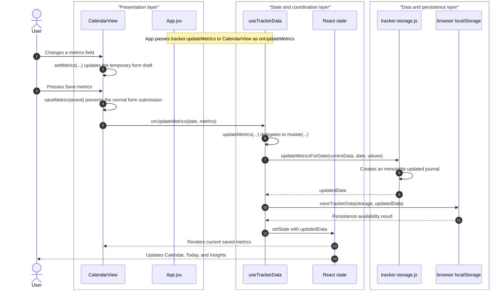

# Architecture and Testing

## Product structure

Routine Tracker is a manual-first React wellness journal with five product views:

- **Today:** a compact, time-aware view of today's selected goals and private check-ins.
- **Calendar:** the complete dated journal for activity, water, sleep, activities, meals, medication confirmations, mood, stress, energy, cycle context, and symptoms.
- **Insights:** descriptive seven-day goal, sleep, activity, hydration, and self-report summaries.
- **Plans:** editable personal goals and user-created medication reminder labels and schedules.
- **Data:** local JSON backup and a reviewed import flow.

The optional **Account** view is a local Supabase Auth demonstration. It supports email/password registration and sign-in on this machine only. A signed-in account receives one journal snapshot identified by its authenticated user ID; signed-out use remains local to the browser.

`src/app/App.jsx` composes the views. `src/features/tracker/` owns the versioned journal contract and mutations. `src/features/wellness/` owns the empty-day shape and pure wellness calculations. `src/features/cloud/` owns the optional authentication and account-scoped sync boundary.

## Journal model and persistence

The version-3 journal keeps editable goals and reminders alongside dated manual entries:

```json
{
  "version": 3,
  "goals": { "steps": 10000, "waterMl": 2000, "sleepMinutes": 480 },
  "medications": [{ "id": "reminder-1", "label": "Daily reminder", "time": "08:00", "weekdays": [] }],
  "days": {
    "2026-09-22": {
      "steps": 6800,
      "waterMl": 2000,
      "sleep": { "bedtime": "22:30", "wakeTime": "06:30", "feeling": "Rested" },
      "activities": [],
      "meals": [],
      "wellbeing": { "mood": "Good", "stress": 3, "energy": 7 },
      "cycle": { "day": 7 },
      "symptoms": [],
      "medicationLogs": { "reminder-1": true }
    }
  }
}
```

Entries are manually entered; the app does not claim to measure sleep stages, diagnose symptoms, prescribe medication, or infer clinical meaning. The daily progress score includes only the user's explicit steps, water, sleep, and meal goals. Medication, mood, stress, energy, cycle, and symptoms are visible as private context and are not scored.

The browser cache uses `localStorage` for continuity. Invalid or legacy version-1/version-2 data is normalized or replaced with a clean demo record rather than crashing. Import accepts only a valid version-3 journal and requires a review before it replaces the current journal.

## Representative local journal update flow

The sequence below follows a signed-out user saving activity and hydration metrics. It is an in-browser event and data-update flow, not a server request/response flow: the visible result is a React re-render, while `localStorage` retains the latest journal for this browser.



`CalendarView` owns only the temporary form draft. `useTrackerData` owns the shared saved journal state, and `tracker-storage.js` supplies pure immutable update helpers. The same coordination layer also performs optional account-scoped cloud sync after state changes when an authenticated local account is configured; that separate account flow is described below.

## Local account demonstration

When local Supabase configuration is present, `useAuth` observes the email/password session. `useTrackerData` then loads the authenticated account's `wellness_snapshots.journal` record, or creates a clean one for a new account. Journal changes are cached locally and saved to that account's snapshot.

The SQL migration in `supabase/migrations/` enables Row Level Security. Its policies allow a signed-in user to select, insert, update, or delete only the row whose `user_id` equals their authenticated ID. The browser receives a publishable key only; a service-role key is never part of the client configuration.

This is a localhost engineering demonstration, not a deployed service. It makes no production privacy, HIPAA, clinical, availability, support, or security-certification claim.

## Test pyramid

| Layer | Purpose |
| --- | --- |
| Vitest unit and component tests | Dates, version-3 validation and migration, journal mutations, wellness calculations, rendered dashboard states, forms, and controls. |
| Playwright | Desktop and mobile journeys for manual logging, plans, import review, insights, accessibility, and responsive behavior. |
| Local account Playwright test | Two disposable accounts register locally; one records water and the other starts with an empty journal, proving the observable account-isolation flow. |
| Manual review | Visual hierarchy, wording, local account flow, and the explicit medical/privacy boundaries. |

Run the complete automated gate with:

```bash
npm run verify:full
```

The full gate requires the local Supabase Docker stack and covers every layer in the table. Setup, reset, and safe local configuration are documented in the [local account demonstration guide](local-account-demo.md).

## Accessibility and responsive review

The app uses native form controls, explicit labels, buttons, visible focus treatment, and a skip link. The browser journey includes automated axe checks on desktop and mobile surfaces. Automated checks complement manual review, especially for visual density and understandable health-adjacent wording.

## Delivery boundary

Routine Tracker remains a local application. No cloud Supabase project, hosted application URL, real-user invitation, or production operation exists. Any real launch would require a separate scope including privacy/legal review, security/threat modeling, account recovery and deletion policies, operational monitoring, support, and deployment verification.
