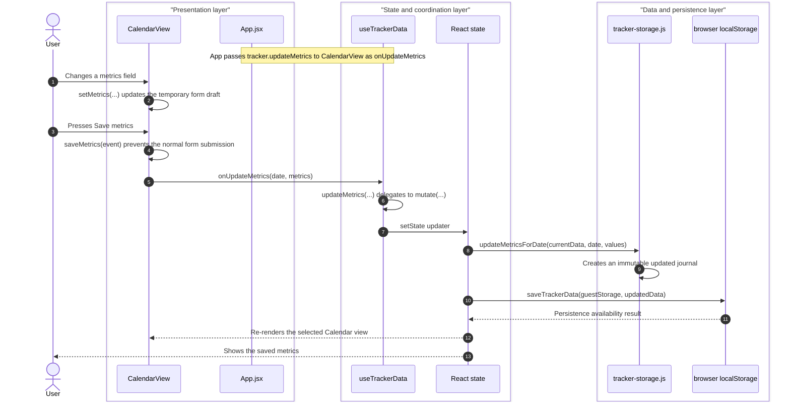

# Architecture and Testing

## Product structure

Routine Tracker is a manual-first React wellness journal with five product views:

- **Today:** a compact, time-aware view of today's selected goals and private check-ins.
- **Calendar:** the complete dated journal for activity, water, sleep, activities, meals, medication confirmations, mood, stress, energy, cycle context, and symptoms.
- **Insights:** descriptive seven-day goal, sleep, activity, hydration, and self-report summaries.
- **Plans:** editable personal goals and user-created medication reminder labels and schedules.
- **Data:** local JSON backup and a reviewed import flow.

The optional **Account** view is a local Supabase Auth demonstration. It supports email/password registration and sign-in on this machine only. A signed-in account receives one journal snapshot identified by its authenticated user ID; signed-out use remains local to the browser.

`src/app/App.jsx` composes the views. `src/features/tracker/` owns the versioned journal contract and mutations. `src/features/wellness/` owns the empty-day shape and pure wellness calculations. `src/features/cloud/` owns the optional authentication and account-scoped sync boundary.

## Journal model and persistence

The version-3 journal keeps editable goals and reminders alongside dated manual entries:

```json
{
  "version": 3,
  "goals": { "steps": 10000, "waterMl": 2000, "sleepMinutes": 480, "bedtime": "22:30", "bedtimeWindowMinutes": 45, "meals": 3, "activityMinutes": 45 },
  "medications": [{ "id": "reminder-1", "label": "Daily reminder", "time": "08:00", "weekdays": [] }],
  "routines": [],
  "days": {
    "2026-09-22": {
      "steps": 6800,
      "waterMl": 2000,
      "sleep": { "bedtime": "22:30", "wakeTime": "06:30", "minutes": 480, "feeling": "Rested" },
      "activities": [],
      "meals": [],
      "wellbeing": { "mood": "Good", "stress": 3, "energy": 7, "note": "" },
      "cycle": { "day": 7, "flow": "", "menopauseSymptoms": [] },
      "symptoms": [],
      "medicationLogs": { "reminder-1": "2026-09-22T08:00:00.000Z" },
      "routineCompletedIds": []
    }
  }
}
```

This is a representative complete journal shape; real exports may have more routines or dated entries. Entries are manually entered; the app does not claim to measure sleep stages, diagnose symptoms, prescribe medication, or infer clinical meaning. The daily progress score includes only the user's explicit steps, water, sleep, and meal goals. Medication, mood, stress, energy, cycle, and symptoms are visible as private context and are not scored.

The browser cache uses separate `localStorage` keys for guest data and each authenticated account. The historical shared key is intentionally not loaded because it has no trustworthy owner after a session expires. Invalid or legacy version-1/version-2 data is normalized or replaced with a clean demo record rather than crashing. Import accepts only a complete valid version-3 journal and requires a review before it replaces the current journal; a rejected import leaves the active journal unchanged.

## Representative local journal update flow

The sequence below follows a signed-out user saving activity and hydration metrics. It is an in-browser event and data-update flow, not a server request/response flow. The state updater performs the immutable calculation and local persistence, then React re-renders the currently selected view.



`CalendarView` owns only the temporary form draft. `useTrackerData` owns the saved journal state, and `tracker-storage.js` supplies pure immutable update helpers. The same coordination layer uses an account-specific cache and optional account-scoped cloud sync only after an authenticated account journal is ready.

## Local account demonstration

When local Supabase configuration is present, `useAuth` resolves the email/password session. `useTrackerData` keeps the journal hidden while identity is unresolved or an account snapshot is loading. It then loads the authenticated account's `wellness_snapshots.journal` record, or creates a clean one for a new account. Journal changes are cached only under that account's browser-storage key and saved to that account's snapshot. A late response for an earlier account is discarded.

The SQL migration in `supabase/migrations/` enables Row Level Security. Its policies allow a signed-in user to select, insert, update, or delete only the row whose `user_id` equals their authenticated ID. The browser receives a publishable key only; a service-role key is never part of the client configuration.

This is a localhost engineering demonstration, not a deployed service. It makes no production privacy, HIPAA, clinical, availability, support, or security-certification claim.

## Test pyramid

| Layer | Purpose |
| --- | --- |
| Vitest unit and component tests | Dates, version-3 validation and migration, journal mutations, wellness calculations, rendered dashboard states, forms, and controls. |
| Playwright | Desktop and mobile journeys for manual logging, plans, reviewed and rejected imports, insights, all-view accessibility, and responsive behavior. |
| Local account Playwright test | Disposable accounts prove persisted data, sign-out/sign-in return, an empty second account, and that expired authentication never exposes an account cache to a guest or another account. |
| Manual review | Visual hierarchy, wording, local account flow, and the explicit medical/privacy boundaries. |

Run the complete automated gate with:

```bash
npm run verify:full
```

The automated layers of the full gate require the local Supabase Docker stack. Manual review remains a separate acceptance activity. Setup, reset, and safe local configuration are documented in the [local account demonstration guide](local-account-demo.md).

## Accessibility and responsive review

The app uses native form controls, explicit labels, buttons, visible focus treatment, and a skip link. The browser journey includes automated axe checks on desktop and mobile surfaces. Automated checks complement manual review, especially for visual density and understandable health-adjacent wording.

## Delivery boundary

Routine Tracker remains a local application. No cloud Supabase project, hosted application URL, real-user invitation, or production operation exists. Any real launch would require a separate scope including privacy/legal review, security/threat modeling, account recovery and deletion policies, operational monitoring, support, and deployment verification.
