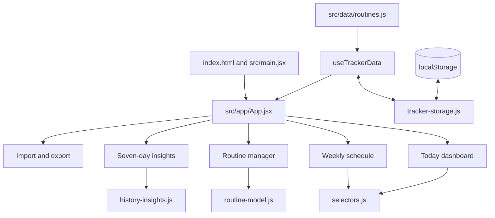

# Routine Tracker Codebase Walkthrough

## How to use this guide

Use this document as a reading map, not as a script to memorize. Begin with the product story, follow one user action through the code, and only then study individual helpers. During an interview, explain the decisions and evidence you understand; do not claim independent authorship of AI-assisted implementation.

Routine Tracker does not use Java-style classes. Its main building blocks are:

- **React components:** functions that return interface elements.
- **A custom hook:** a function that connects React state to persistence behavior.
- **Pure domain functions:** functions whose output depends only on their inputs, which makes them easy to test.
- **Configuration and automation files:** build, lint, browser-test, CI, and screenshot instructions.

## Recommended reading order

1. `README.md` — product purpose, capabilities, boundaries, commands, and contribution disclosure.
2. `docs/product-case-study.md` — audience, user journeys, decisions, and rejected alternatives.
3. `docs/architecture-and-testing.md` — storage contract, migration, test layers, and delivery boundary.
4. `src/app/App.jsx` — the composition root and the best map of the five views.
5. `src/features/tracker/use-tracker-data.js` — the shared state and action API used by the views.
6. `src/features/tracker/tracker-storage.js` — validation, migration, persistence, snapshots, and immutable updates.
7. One complete user flow, starting with Today and then moving to routine editing, insights, or import.
8. Tests that prove the behavior, beginning with the pure unit tests and ending with `e2e/routine-tracker.spec.js`.

## Runtime architecture



`App.jsx` is the composition boundary: it decides which view is visible and passes state or callbacks into that view. It does not validate routines, calculate history, or parse browser storage. Those responsibilities live in dedicated modules.

## Data model

The persisted object has one explicit version and two major collections:

```json
{
  "version": 2,
  "routines": [],
  "days": {
    "2026-09-21": {
      "completedStepIds": [],
      "stepSnapshot": []
    }
  }
}
```

`routines` is the current editable library. `days` is historical evidence indexed by local calendar date. A daily `stepSnapshot` retains only the stable step ID and category required by reporting. This means editing or deleting a routine tomorrow does not change yesterday's totals.

A completed-step ID combines a routine ID and step ID, for example `am-care:open-window`. Display text is not used as an identity because users can edit it.

## User flow 1: application startup

1. `index.html` provides the browser root element.
2. `src/main.jsx` mounts `App` inside React `StrictMode` and loads global styles.
3. `App.jsx` calls `useTrackerData(routines)` with the fictional starter library.
4. `use-tracker-data.js` asks `tracker-storage.js` to load and validate the saved record.
5. The loader returns one of four meaningful states: clean V2 data, migrated V1 data, recovered demo data after invalid storage, or session-only data when storage is unavailable.
6. `App.jsx` shows Today by default and passes the hook's routines, completed IDs, status flags, and toggle action into the dashboard.

## User flow 2: completing a Today step

1. `TodayDashboard.jsx` uses the device-local weekday and `selectors.js` to choose today's AM and PM routines.
2. `RoutineCard.jsx` creates a stable ID from the routine and step IDs.
3. Checking the native checkbox calls the `toggle` action exposed by `useTrackerData`.
4. The hook calls the pure `toggleStepForDate` function.
5. `toggleStepForDate` rejects IDs that are not available today, updates a copied data object, and stores today's compact snapshot.
6. The hook attempts to save the new object to `localStorage` and updates React state.
7. React renders the new card and daily totals. `ProgressPill` announces the change through an `aria-live` region.

## User flow 3: creating or editing a routine

1. `RoutineManager` owns only temporary UI state: whether the form is open, the current draft, validation messages, and confirmation dialogs.
2. On submit, it sends the draft to `routineFromDraft` in `routine-model.js`.
3. The pure model trims input, checks required values and duplicate step names, and creates collision-safe IDs for new routines and steps.
4. The manager reports the accepted routine through `onSave`.
5. `App.jsx` connected `onSave` to the hook's `saveRoutine` action.
6. The hook replaces an existing routine by ID or appends a new one, persists the complete V2 record, and triggers a render.

Delete and restore operations require confirmation. They replace only the current routine library; already saved daily snapshots remain available to Insights.

## User flow 4: migration and recovery

`tracker-storage.js` is deliberately defensive because browser storage is an external boundary:

1. Read access is wrapped in `try/catch` because privacy settings can block it.
2. JSON parsing is isolated from contract validation.
3. A valid V1 record is converted into V2 using the known starter routine snapshot for that date.
4. Duplicate or unavailable completed IDs are removed during migration.
5. Invalid JSON or an invalid contract returns clean demo data plus a recovery flag.
6. The hook writes a successful migration back once, so the next launch reads V2 directly.

The app does not silently claim that unavailable storage succeeded. It continues in memory and shows a session-only notice.

## User flow 5: seven-day insights

`history-insights.js` performs all calculations without React or browser APIs:

- It creates seven local dates ending with today.
- For today only, it may infer available steps from the current schedule when no record has been stored yet.
- For prior days, it uses only saved snapshots; missing history stays missing.
- It produces daily completion counts, percentages, recorded-day counts, and category totals.

`InsightsView` is only the presentation layer. This separation lets unit tests verify calculations without rendering a page.

## User flow 6: export and import

`DataManagement` and `tracker-storage.js` form a two-stage safety boundary:

- Export normalizes the current V2 object, serializes readable JSON, and creates a local browser download.
- File selection reads the selected local file and validates its complete contract.
- Invalid content shows an error and leaves current state unchanged.
- Valid content is summarized as a preview.
- Replacement occurs only after the user presses the explicit confirmation button.

The application has no upload request, account, backend, analytics service, or cloud sync.

## Folder and file map

### Product and delivery documentation

| Path | Responsibility |
| --- | --- |
| `README.md` | Public entry point: purpose, screenshots, boundaries, setup, verification, and contribution disclosure. |
| `docs/product-case-study.md` | Product problem, journeys, decisions, rejected alternatives, and acceptance evidence. |
| `docs/architecture-and-testing.md` | Technical architecture, V2 schema, migration, insights, test pyramid, and delivery boundary. |
| `docs/codebase-walkthrough.md` | Guided reading map and interaction flows. |
| `docs/screenshots/` | Reproducible portfolio images generated from fictional state. |

### Application entry and composition

| Path | Responsibility |
| --- | --- |
| `index.html` | Minimal HTML document and React mount point. |
| `src/main.jsx` | Browser bootstrap and global stylesheet import. |
| `src/app/App.jsx` | Navigation, feature composition, and shared-state wiring. |
| `src/styles/index.css` | Design system, layout, states, accessibility focus, and responsive rules. |

### Shared data and presentation

| Path | Responsibility |
| --- | --- |
| `src/data/routines.js` | Fictional starter routines and category labels/icons. |
| `src/components/ProgressPill.jsx` | Reusable accessible completion summary. |

### Today and Schedule

| Path | Responsibility |
| --- | --- |
| `src/features/completion/date.js` | Local date, weekday, and display formatting. |
| `src/features/dashboard/TodayDashboard.jsx` | Today's routine selection, recovery notices, and overall progress. |
| `src/features/dashboard/PeriodSection.jsx` | AM/PM grouping and empty state. |
| `src/features/dashboard/RoutineCard.jsx` | Interactive steps and per-routine progress. |
| `src/features/schedule/ScheduleView.jsx` | Read-only week preview and accessible tabs behavior. |
| `src/features/routines/selectors.js` | Shared filtering and progress calculations. |

### Routine management

| Path | Responsibility |
| --- | --- |
| `src/features/routines/routine-manager.jsx` | Form state, step ordering, library cards, and destructive confirmations. |
| `src/features/routines/routine-model.js` | Draft validation, normalization, and stable ID creation. |

### Persistence, portability, and insights

| Path | Responsibility |
| --- | --- |
| `src/features/tracker/tracker-storage.js` | V2 contract, validation, V1 migration, normalization, storage access, snapshots, and toggling. |
| `src/features/tracker/use-tracker-data.js` | React adapter for shared state, persistence actions, and local-date refresh. |
| `src/features/tracker/data-management.jsx` | Local JSON download, file review, import preview, and confirmation. |
| `src/features/insights/history-insights.js` | Pure seven-day and category calculations. |
| `src/features/insights/insights-view.jsx` | Read-only insight cards, rows, and accessible progress bars. |

### Tests and automation

| Path | Responsibility |
| --- | --- |
| `src/**/*.test.js(x)` | Pure unit and React component tests colocated with the behavior they verify. |
| `src/test/setup.js` | Shared DOM assertions and per-test React cleanup. |
| `e2e/routine-tracker.spec.js` | Complete user journeys, persistence, responsive containment, date behavior, and axe scans. |
| `scripts/capture-screenshots.mjs` | Deterministic desktop/mobile portfolio captures. |
| `.github/workflows/verify.yml` | Future remote clean install, lint, tests, build, browser checks, and dependency audit. |

### Tool configuration

| Path | Responsibility |
| --- | --- |
| `package.json` / `package-lock.json` | Runtime/tool dependencies and exact repeatable dependency resolution. |
| `vite.config.js` | React build and Vitest DOM-test environment. |
| `playwright.config.js` | Local test server plus desktop and mobile Chromium projects. |
| `eslint.config.js` | React and Hooks static-analysis rules. |
| `tailwind.config.js` / `postcss.config.js` | CSS processing configuration. Most product styling is explicit CSS. |

## Test strategy

The project uses the smallest useful layer for each risk:

- **Pure unit tests** cover dates, schema validation, migration, normalization, snapshots, stable IDs, and historical calculations.
- **Component tests** cover rendered state, interaction, form errors, confirmation behavior, and Schedule keyboard semantics.
- **Playwright tests** cover journeys that depend on a real browser: reload persistence, CRUD across views, downloads/imports, viewport containment, local-date reset, and accessibility scans.
- **Manual review** covers visual hierarchy, content tone, responsive fit, and whether public documentation matches the product.

The important quality principle is not the number of tests. It is the mapping from a product risk to an independent check and observable result.

## How to present the repository in an interview

Use this order rather than opening random source files:

1. State the user problem and the local-first boundary from `README.md`.
2. Show the five product views and one primary journey.
3. Open `App.jsx` to identify the composition root.
4. Follow state into `use-tracker-data.js` and then the pure storage contract.
5. Explain one deliberate decision: historical snapshots, reviewed import, or local-calendar behavior.
6. Open the matching unit/component test and then the browser journey.
7. Close with limitations, contribution disclosure, and what you would validate before adding sync or accounts.

Keep three evidence levels separate:

- **Implemented:** behavior exists in the current files.
- **Verified locally:** a recorded command or review observed the result.
- **Not yet verified remotely:** GitHub Actions and deployment have not run while the repository remains local.

## Suggested walkthrough checkpoints

Complete these in order with one explanation at a time:

1. Product overview and boundaries.
2. Folder map and application startup.
3. Today completion flow.
4. Routine create/edit/delete flow.
5. V2 contract and V1 migration.
6. Historical snapshot decision.
7. Import validation and destructive-action boundary.
8. Accessibility and responsive decisions.
9. Test pyramid and one risk-to-test example.
10. Contribution disclosure, limitations, and future architecture gate.
