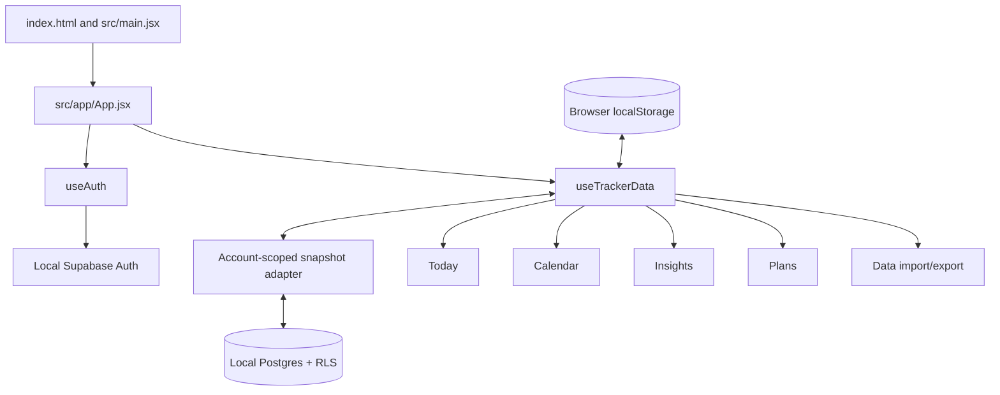

# Routine Tracker Codebase Walkthrough

## How to use this guide

Read this as a map for a live explanation, not as a script to memorize. Start with the product boundary, follow one visible action through the code, then open the matching test. Explain only decisions and results you understand. The implementation is AI-assisted; Julia's contribution is product direction, requirements, acceptance, review, and validation.

## Recommended reading order

1. `README.md` — purpose, local-only boundary, commands, and account safety notes.
2. `docs/product-case-study.md` — user journey, product decisions, and explicit limits.
3. `docs/architecture-and-testing.md` — version-3 journal, local account model, and test strategy.
4. `src/app/App.jsx` — composition root and navigation.
5. `src/features/tracker/use-tracker-data.js` — shared journal state, local cache, account transition, and mutations.
6. `src/features/tracker/tracker-storage.js` — versioned validation, migration, and journal updates.
7. `src/features/cloud/` — optional local Supabase session and snapshot sync.
8. One complete browser flow plus its Playwright coverage.

## Runtime architecture



`App.jsx` only selects a view and wires callbacks. It does not calculate sleep duration, mutate journal entries, parse stored data, or write Supabase rows.

For the exact callback-to-persistence path behind a signed-out Calendar metrics save, see the [representative local journal update flow](architecture-and-testing.md#representative-local-journal-update-flow). Use it to orient the code reading below; it intentionally does not repeat the account-synchronization flow.

## Journal and account boundary

`tracker-storage.js` normalizes a version-3 journal with editable goals, medication reminder labels, and date-indexed manual entries. `wellness-model.js` provides a safe empty day and pure calculations such as manually logged sleep duration and daily goal progress.

`useTrackerData` writes every mutation to the active owner's browser cache. Guest data and every authenticated account use different keys, so sign-out restores the separate guest journal without exposing the prior account cache. For a connected account, mutations are queued in order to its single `wellness_snapshots` record. A failed snapshot read leaves cloud writing disabled until a later reload reconnects, so a cache fallback cannot erase the server journal.

The cloud adapter never owns a service-role secret. The SQL migration applies RLS so a user can only access the row tied to that authenticated user's ID. This is verified locally with two disposable accounts; it is not a production security certification.

## Walkthrough flow: register, log, and return

1. `AuthView` gathers an email and password and calls `useAuth.signUp` or `useAuth.signIn`.
2. `useAuth` delegates the session operation to the optional Supabase browser client.
3. The session user ID reaches `useTrackerData` through `App.jsx`.
4. `useTrackerData` calls `loadCloudSnapshot(userId)`. A new account receives a clean, normalized journal and one account-scoped snapshot is created.
5. In `CalendarView`, a form calls a mutation such as `onUpdateMetrics`, `onUpdateSleep`, `onAddActivity`, or `onAddMeal`.
6. The mutation delegates to a pure `tracker-storage.js` helper inside the React state updater, updates the owner-specific local cache, and queues the validated snapshot when signed in. The [representative local journal update flow](architecture-and-testing.md#representative-local-journal-update-flow) illustrates the signed-out metrics path.
7. `TodayDashboard` and `InsightsView` derive their visible summaries from the same dated journal.
8. After sign-out and sign-in, the adapter loads the same account snapshot rather than another account's cache.

## High-value code paths

| Path | What to explain |
| --- | --- |
| `src/app/App.jsx` | The view boundary and the separation between session state and journal state. |
| `src/features/calendar/calendar-view.jsx` | Manual forms are intentionally explicit; sleep is a schedule entry, not a biometric measurement. |
| `src/features/dashboard/TodayDashboard.jsx` | Today is compact; it exposes progress and small actions rather than duplicating the entire journal. |
| `src/features/insights/wellness-insights.js` | Insights are pure descriptions of recorded entries, not diagnoses or causation claims. |
| `src/features/plans/plans-view.jsx` | Goals and reminder labels are chosen by the account holder. |
| `src/features/tracker/tracker-storage.js` | Versioning, validation, reviewed import, and immutable mutation helpers. |
| `src/features/tracker/use-tracker-data.js` | Owner-specific cache continuity, ordered saves, stale-callback protection, and optional account sync. |
| `src/features/cloud/cloud-storage.js` | A validated journal snapshot boundary for each authenticated local account. |
| `supabase/migrations/20260922130000_create-wellness-snapshots.sql` | RLS ownership boundary at the database layer. |
| `e2e/local-auth.spec.js` | Observable account registration and journal-isolation proof. |

## Test strategy

- **Unit/hook/component tests:** journal model, checked version migration and server data, ordered account saves, stale callbacks, manual-entry mutations, insight calculations, forms, and display states.
- **Browser tests:** desktop/mobile flows, manual logging, reminder persistence, bounded inputs, import review, accessibility scans, and responsive behavior.
- **Local account tests:** disposable accounts prove cross-account isolation, expired-session safety, persistence, and non-destructive behavior after a failed snapshot read.
- **Manual review:** visual density, health-adjacent language, complete signup/signout/signin cycle, and local-only boundaries.

Run the current local checks with:

```bash
npm run verify:full
```

## How to present it in an interview

1. Open with the problem: a progress-oriented manual journal, not a wearable or medical product.
2. Demonstrate a fictional account registering and recording a day in Calendar.
3. Show the compact Today progress and one descriptive Insight.
4. Explain the account boundary: email/password session, one snapshot per user, RLS in the migration, publishable browser key only.
5. Sign out and sign in again, then show persistence. If time allows, use a second disposable account to show isolation.
6. Close with truthful limits: localhost only, no real users or health advice, no public deployment, and AI-assisted implementation.

The strongest answer is precise rather than broad: name one behavior, the responsible module, the check that exercises it, and the boundary the project intentionally does not cross.
