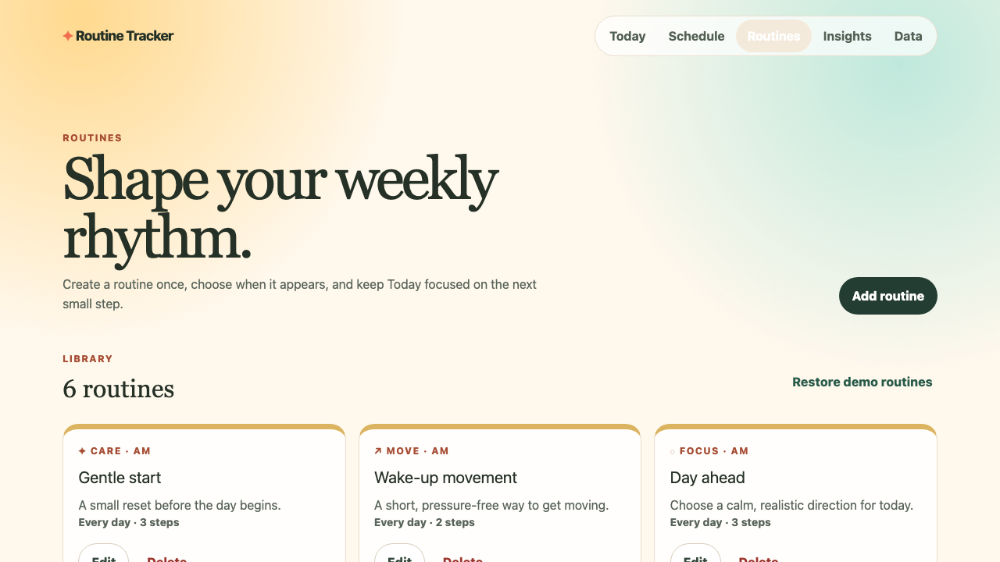
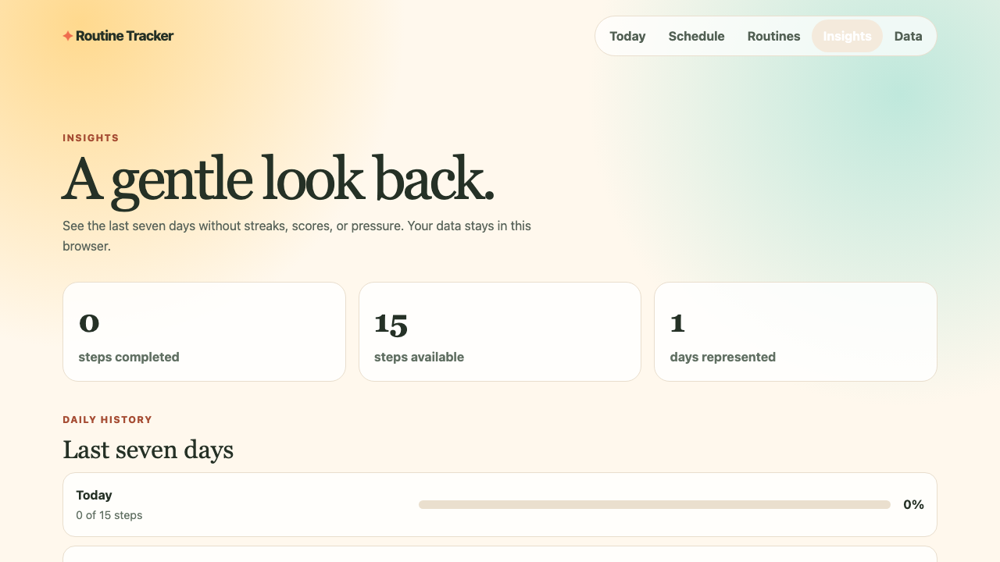

# Routine Tracker Product Case Study

## Problem and audience

Routine Tracker is for a person who wants a calm view of a daily rhythm without turning a personal checklist into a quantified productivity system. The original static reference could show instructions but could not preserve progress, adapt the weekly plan, or help the user review recent activity.

The V1.1 product closes that loop locally: plan routines, follow Today, retain dated progress, review seven days, and carry the data between browsers through an explicit backup file.

## Primary journeys

### Follow today

1. Open **Today** and see the local date, AM/PM groups, and total progress.
2. Complete a Care, Move, or Focus step and see card plus daily progress update.
3. Reload during the same day and retain progress.
4. Start a clean Today view after the local calendar date changes while retaining the prior day's snapshot.

### Shape the week

1. Open **Routines** and create or edit a routine.
2. Choose its category, AM/PM period, weekdays, and ordered steps.
3. Use **Schedule** to preview each weekday without changing completion.
4. Confirm before deleting a routine or restoring the fictional demo library.

### Review and protect data

1. Open **Insights** for seven-day daily and category summaries without streak pressure.
2. Download a readable version-2 JSON backup.
3. Select an import, review its routine/day/version summary, and explicitly confirm replacement.
4. Reject malformed or incompatible content without changing current data.

| Routine management | Seven-day insights |
| --- | --- |
|  |  |

## Key decisions

| Decision | Why |
| --- | --- |
| Today-first dashboard | The immediate job is following today's rhythm, not configuring the product. |
| Editable library plus read-only Schedule | Configuration has a clear home while Schedule remains a safe preview. |
| Versioned local contract | The app works without an account and can evolve through explicit migrations. |
| Daily step/category snapshots | Historical totals remain defensible after routines are edited or deleted. |
| Seven-day insights without streaks | The product shows useful patterns without turning care into a score. |
| Previewed import | A file is validated and summarized before destructive replacement. |
| Care, Move, Focus fictional content | It demonstrates the product without medical, dosage, or private personal data. |

## Rejected alternatives

- **Accounts and cloud sync:** they require authentication, authorization, privacy, backend, deployment, and operations work that would change the project rather than complete the local product.
- **Streaks and behavioral scoring:** they conflict with the calm, low-pressure product direction.
- **Browser notifications:** permission and scheduling complexity did not justify the value without user research.
- **Medical, supplement, or dosage content:** unsuitable for a public portfolio demo.
- **Silent import:** unsafe because malformed or unintended files could overwrite local data without review.

## Acceptance evidence

The repository includes unit tests for date behavior, schema validation, version migration, storage recovery, routine normalization, and insight calculations; component tests for dashboard states, accessible Schedule behavior, routine validation, and confirmations; and Playwright coverage across desktop and mobile for persistence, responsive containment, Schedule behavior, full routine CRUD, JSON download/import review, insights, date reset, and axe accessibility scans.

The local release workflow runs lint, tests, production build, both Playwright projects, and a dependency audit. The GitHub Actions workflow is prepared to repeat that sequence only after publication is separately approved.

## Contribution model

Julia owned product direction, audience, requirements, acceptance criteria, visual direction, scope control, review, and validation. Implementation was AI-assisted. This is an intentionally transparent product-ownership and quality-engineering case study rather than a claim of independent React authorship.
